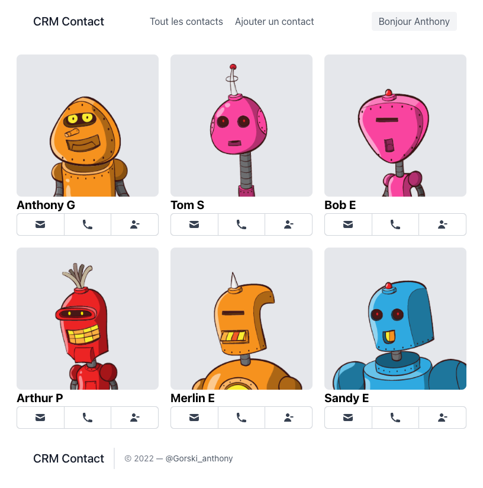
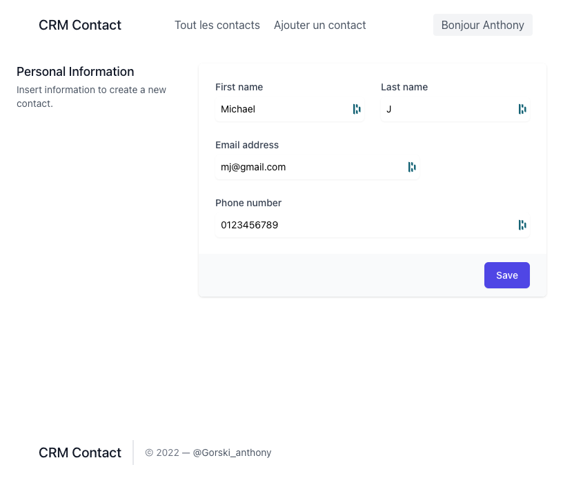
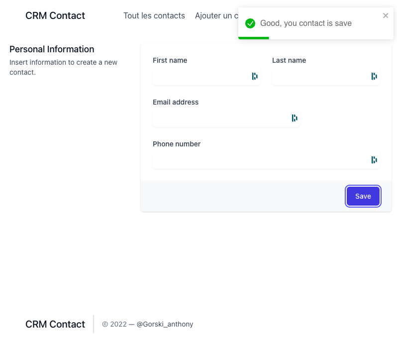
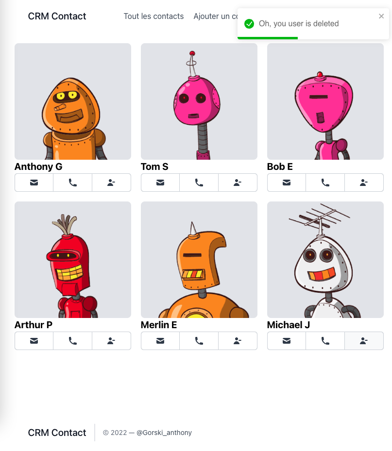

# Template d'un projet pour deployer sur Heroku

## Installation

Ne pas hésiter à fork le projet [GitHub](https://github.com/GorskiAnthony/WCS_prod).

Sinon : 
```shell
# Clone the project
git clone git@github.com:GorskiAnthony/WCS_prod.git
# Go to the project directory
cd WCS_prod
```

Ensuite, vous pouvez installer les dépendances avec la commande suivante :

```shell
# In root directory of the project
# Install all dependencies with npm
npm run setup
# Run development server
npm run dev
```

## Les branches

- `crm` : est la branche initiale du projet. Elle ne contient que le code de base du projet.
- `frontend` : est la branche qui contient le code du frontend.
- `backend` : est la branche qui contient le code du backend.
- `fullstack` : est la branche qui contient le code du frontend et du backend avec les petites mise à jour.
- `deploy` : est la branche qui sera utilisée pour le déploiement sur Heroku.

## Frontend







## Backend

Nous allons utiliser l'ORM [Prisma](https://www.prisma.io/) pour gérer notre base de données.
